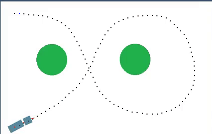

# TractorTrailerLQR

A browser based tractor-trailer robot simulator that uses an LQR steering controller. A live demo can be found [here](https://jspurney.github.io/TractorTrailerLQR/).

### How to use
- Open [index.html](./index.html) with your favorite browser
- Select a map with the dropdown selector (right now maps are just for show)
- Hold your left-click mouse button down on the simulator window to create a path for the robot to follow
- If you don't like your path you can use the clear path button
- Once you are satisfied with your path, click on the start simulation button

### Dependencies
- [QUnit-2.6.1](https://qunitjs.com/)

### Style Guide
- For the most part the default style guide enforced by [Prettier](https://github.com/prettier/prettier)
- The only difference is that the maximum line length rule is set to 100

### Running the tests
- Open [tests.html](./tests/tests.html) with your favorite browser

### License
- The project is licensed under the MIT License - see the [LICENSE](./LICENSE) file for details
